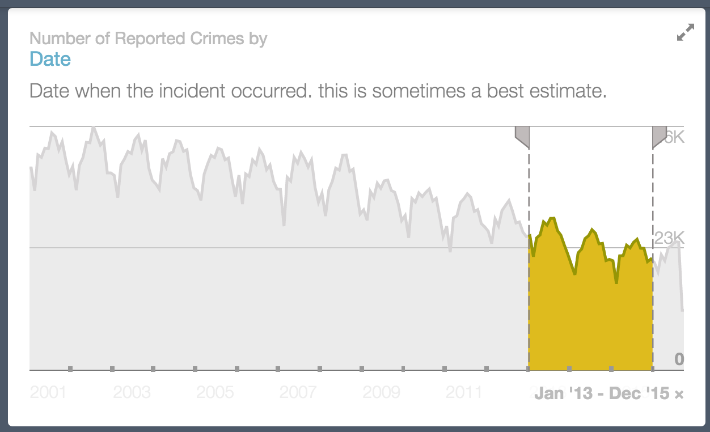
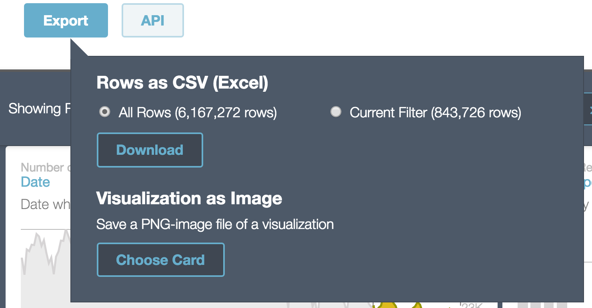

# Assignment 1: Welcome to the Command Line   

Your main task this week is to install the software that you will use for the rest of this class.
You will also do some basic navigation of Chicago crime and city salaries, with command line tools.
To "accept" the assignment and create your repository,
  you must first complete the setup instructions below,
  including creating your GitHub account.

This assignment is due Wednesday October 4 at 1:30am.
A computer will collect it -- not me.  So don't be late!!

## Preliminaries/Setup

Please see installation instructions for
* [PC](windows_install.md) 
* <details><summary>Mac</summary>
* You will need to have a 'Terminal' set up on your computer.  If you're running a Mac, it _is_ installed.  Just Spotlight search for 'Terminal.'  If you have a Windows machine, you'll need to install [cygwin](https://cygwin.com/install.html).  Since the Windows install is a bit more finnicky, you can find additional instructions [here](windows_install_instructions.md).
* Download the Python 3.5, 64-bit [Anaconda](https://www.continuum.io/downloads) (Graphical Installer is easier), and install it on your computer.  (It may ask for your business email -- ignore it.)  When the install is complete, if you now run your Terminal and type `python`, then hit `<Enter>`, you should get a new command prompt.  It should say `Python 3.5.2 |Anaconda...`  You can test it out (`1 + 1`, then `<Enter>`) and quit (`quit()` or `ctrl+D` on a Mac).  As above -- Windows users please see the [additional instructions](windows_install_instructions.md).
  * If the installer asks whether or not it can edit your .bashrc, the answer is _yes_.
* I encourage you to use [Atom](https://atom.io/) as a text editor for your first assignment; it provides syntax highlighting that you will find useful.  The [Download](https://atom.io/) and installation should be trivial.  If you want, you can delete it when you're done.
  * Atom requires OS X 10.8 or later.  For 10.6 or 10.7, try Sublime or TextWrangler ([4.5.12](http://www.barebones.com/support/textwrangler/updates.html)).
* Finally, create a [student GitHub account](https://education.github.com/pack), or just a standard GitHub account.  You will use this account to push (submit) all of your work.  Download and install [git](https://git-scm.com/downloads).
  * If you are running Mac OS X 10.7 or 10.8, you may need to get your git from [Sourceforge](https://sourceforge.net/p/git-osx-installer/activity/?page=0&limit=100#57cc86a334309d5c609e9fc8); search for version git-2.3.5-intel-universal-snow-leopard.dmg.  If you did the Window Cygwin setup, it should have included git.
  * You will have to 'create an ssh key for your account.'  This is just the way that the git encrypts communication (lets you download files); `ssh` (secure shell) is the standard way that we make secure connections from the command line.  Follow the instructions to [generate a new ssh key](https://help.github.com/articles/generating-a-new-ssh-key-and-adding-it-to-the-ssh-agent/) and [add it to your GitHub account](https://help.github.com/articles/adding-a-new-ssh-key-to-your-github-account/).  If you have trouble creating the passphrase when the time comes ... don't (just leave it blank/hit return).  By providing the `id_rsa.pub` to GitHub, you're permanently telling it the call and response (Marco/Polo) so that it knows your computer is _you_.  This last piece is not a prerequisite for starting on Monday, but _will_ be necessary, for downloading and starting your homework.
   * If `pbcopy` doesn't work, the piece that you'll paste into the GitHub site, is the output of `cat ~/.ssh/id_rsa.pub`.
</details>.
Completion of this portion of the assignment 

Please see the [preliminary instructions](preliminaries.md) for running the terminal, python, and a text editor.

You can then join this assignment [here](https://classroom.github.com/assignment-invitations/8cfa1521ab98e0dfb7341771721f793b).  You'll get an email telling you that the import is complete.
* Open the Terminal and navigate (`cd`) to whatever directory (folder) you want to work from.  The choice of directory is up to you -- just as you'd save the documents for any other class.
* Issue ```git clone git@github.com:harris-ippp/hw-1-UserName.git``` (replacing `Username` by your GitHub user name), to download the directory.
* Now `cd` into the directory and get to work!

## Command Line Tools

### Downloading some data.

In class, we played with the city salaries file.  You can re-retrieve that file via:

```
curl data.cityofchicago.org/api/views/xzkq-xp2w/rows.csv -s -o salaries.csv
```

Let's also grab some crime data.

* Go to the data portal for the City of Chicago, and navigate to "Crimes - 2001 to present"
  * You can find it here: https://data.cityofchicago.org/view/5cd6-ry5g
* We'll look at the last three full years of data, 2013-2015.  Highlight it as shown in the picture below.
* Now click on "Export." Then under "Rows as CSV," select "Current Filter (843,726 rows)".  (Don't worry if it goes up by a few, before the assignment is over: it seems not to be totally stable.)  Then "Download" (see second picture).  It's about 200 MB, so ... wait!
* (Yes, there are neat tools for doing your homework, on the website.  But we'll start from the beginning and go further.
* If this whole data grab is not working, just click this [link](https://data.cityofchicago.org/api/views/6zsd-86xi/rows.csv?accessType=DOWNLOAD&bom=true&query=select+*+where+%60date%60+%3E%3D+%272013-01-01T00%3A00%3A00%27+AND+%60date%60+%3C+%272016-01-01T00%3A00%3A00%27).
* Move this file to your homework directory, naming it as you like (I call mine chicago_crime.csv).
* DO NOT, along the way, open this file in Microsoft Excel and save it.  It will change how the lines are ended (return/enter) in the file, and make it stop working for you.

We'll soon learn to grab these resources programmatically.  But it's already a start to get comfortable grabbing datasets from the wonderful Chicago Data Portal!

## Most Excellent Exercises!

You now have chicago_crime.csv and salaries.csv in your homework directory.  There are several scripts, `police_officers.sh`, `police_names.sh`, `detectives.sh`, and `homicide.sh`.  These have structures for each of the questions below, which you'll fill out.  Open these files with Atom; then one step at a time replace the `cat` commands on each line, to complete the scripts.  (See [salaries.sh](https://github.com/harris-ippp/01-welcome/blob/master/salaries.sh) for an example.)  When you're done, fill in SOLUTIONS, as directed.  

So: you will modify the files in the directory, and then send it back to GitHub.  Since you've made a copy of the repository by accepting the assignment, all of your work will be separate and will not interfere with your classmates.  We will see your edited files (provided that you uploaded them on git), and you can check this too, by navigating to your own repository on your GitHub page. 

### Highest Salaries

* The question you already answered in class: who makes the most?

### Police Officers of the City of Chicago

* How many police officers are there in Chicago?
* How many of them are detectives?
* What is the most common first names of police officers?  What do you notice?

### Crime, in particular first degree murders.

Based on the 2013-2015 data:

* What hour of the day (1AM, 3PM, 00AM?) are the most first degree murders in Chicago?
* What is the bloodiest month for Chicago?
* What was the bloodist single day?
* Where are the most people killed (vacant lot? tavern?  stairwell?  house?  alley?)?

(Apologies, I realized after-the-fact that this may be a bit dark.)

When you're all done, commit and push the code:
```
git add SOLUTIONS *sh  # add the relevant files
git status # check that all your modified files are listed
git commit -m "phewff, all done!"
git push
```

See the expanded tabs, for the following errors:
<details>
  <summary>**Please tell me who you are.**</summary>
  ```
*** Please tell me who you are.
Run
git config --global user.email "you@example.com"
git config --global user.name "Your Name"
```

If so, just follow its instructions -- run the two `git config` commands it suggests, substituting your name and email.
</details>

<details>
  <summary>**I committed the CSV files, and now it's complaining.**</summary>

You are getting errors like this:

```
remote: error: GH001: Large files detected. You may want to try Git Large File Storage - https://git-lfs.github.com.
remote: error: Trace: 88bd8639e80773fe30a7111ee335f48b
remote: error: See http://git.io/iEPt8g for more information.
remote: error: File crimes_chicago.csv.csv is 185.82 MB; this exceeds GitHub's file size limit of 100.00 MB
```

If you did this, you added ALL files, instead of just SOLUTIONS and the *.sh files. The CSV files (the crimes in particular) are very large, and github won't it accept files above 100 MB. The problem is that you've added it to your history. Even if you remove it at this point, git will still try to upload it, because it preserves a full history. You can remove it from the history by doing the following:

```
git filter-branch --force --index-filter 'git rm -r --cached --ignore-unmatch crimes.csv' --prune-empty --tag-name-filter cat -- --all
```

But please back up your work before doing this, it's potentially destructive. 

</details>


Just make sure it's in before Wednesday October 5th at 1:30am!

### Helpful Readings
* Python: [Think Python](http://proquestcombo.safaribooksonline.com.proxy.uchicago.edu/book/programming/python/9781449332006) (Downey), Chapters 1, 2, 10, and 11.  For an alternative take, consult chapters 1-5 of the official [Python Tutorial](https://docs.python.org/3/tutorial/index.html).
* Git: [Hello World](https://guides.github.com/activities/hello-world/), GitHub Guides.

### Suggested Readings
* Data and Technology in Government: [Innovative State](https://smile.amazon.com/Innovative-State-Aneesh-Chopra/dp/0802121349/) (Aneesh Chopra), and [The Responsive City](https://smile.amazon.com/Responsive-City-Communities-Data-Smart-Governance-ebook/dp/B00MQTIA3M/) (Stephen Goldsmith and Susan Crawford).


### Pictures for Data Portal



